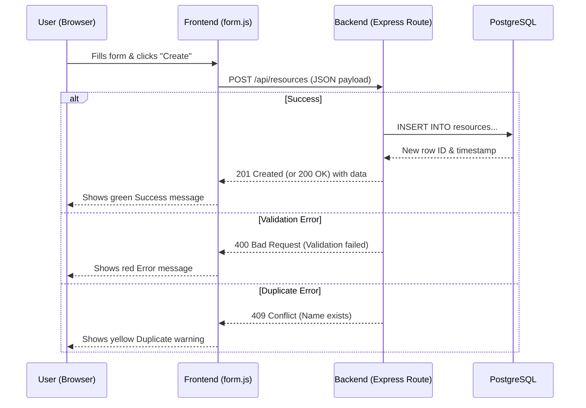
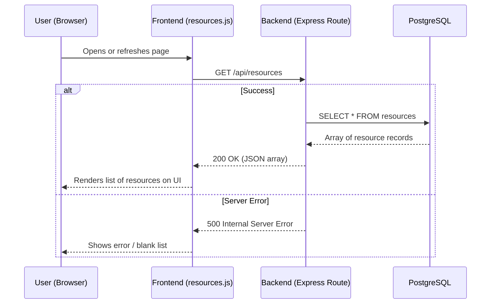
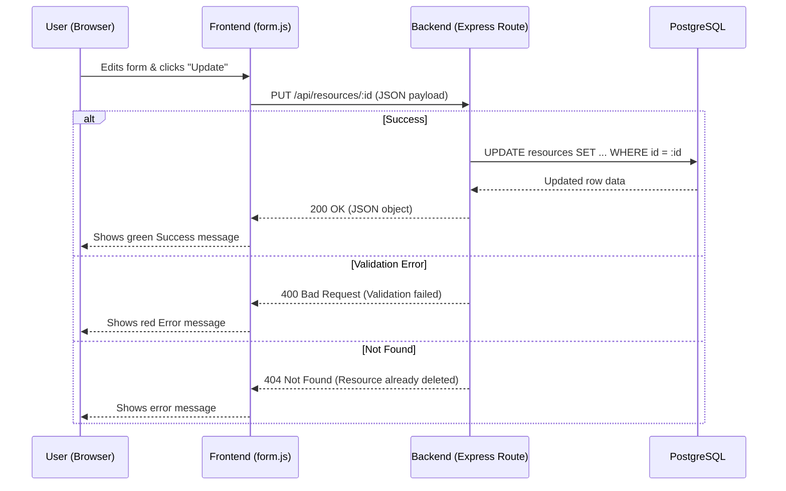

# Booking System Phase 6: CRUD Data Flow Models

This document maps out the data flow for Create, Read, Update, and Delete operations in Phase 6, verified using browser Developer Tools.

## 1. CREATE (C) Operation
**Trigger:** User fills out the resource form and clicks "Create".
**Endpoint:** `POST /api/resources`


## 2. READ (R) Operation
**Trigger:** User opens or refreshes the resources page.
**Endpoint:** `GET /api/resources`


## 3. UPDATE (U) Operation
**Trigger:** User clicks a resource, edits the form, and clicks "Update".
**Endpoint:** `PUT /api/resources/:id`


## 4. DELETE (D) Operation
**Trigger:** User clicks a resource, and clicks the red "Delete" button.
**Endpoint:** `DELETE /api/resources/:id`

```mermaid
sequenceDiagram
    participant U as User (Browser)
    participant F as Frontend (form.js)
    participant B as Backend (Express Route)
    participant DB as PostgreSQL

    U->>F: Clicks red "Delete" button
    F->>B: DELETE /api/resources/:id
    
    alt Success
        B->>DB: DELETE FROM resources WHERE id = :id
        DB-->>B: Row deleted
        B-->>F: 204 No Content
        F-->>U: Shows green Success message & clears form
    else Not Found
        B-->>F: 404 Not Found (Resource already deleted)
        F-->>U: Shows error message
    end        